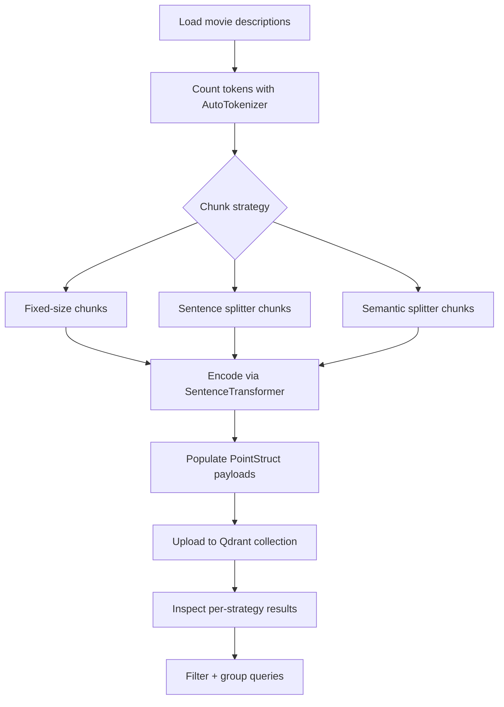

## Movie Search Pipeline

This script builds an in-memory semantic search playground focused on comparing chunking strategies before indexing movie synopses in Qdrant.

### What the script does
- Loads a curated list of sci-fi movie descriptions with metadata (`name`, `author`, `year`).
- Instantiates `SentenceTransformer("all-MiniLM-L6-v2")` for embeddings and a Hugging Face tokenizer to measure chunk sizes.
- Prints token counts per description to highlight anything exceeding the `256`-token threshold used elsewhere in the stack.
- Spins up an in-memory `QdrantClient` and creates a `my_movies` collection with three named vector slots (`fixed`, `sentence`, `semantic`) so each chunking strategy can be queried independently while sharing payload metadata.
- Defines three chunking approaches:
  - **Fixed size**: deterministic blocks of `MAX_TOKENS=40`.
  - **Sentence splitter**: `SentenceSplitter` with configurable overlap to keep adjacent context.
  - **Semantic splitter**: `SemanticSplitterNodeParser` (Hugging Face embeddings + breakpoint percentile) to cut text where semantics change.
- Iterates over every movie description, runs all three chunkers, encodes each chunk with the shared encoder, and uploads the resulting vectors/payloads to Qdrant.
- Compares chunking strategies by running `search_and_inspect` across all three vector namespaces and prints ranked metadata-rich hits (score, strategy, chunk preview).
- Demonstrates filtered search (`year >= 2000`) and grouped search (group-by `name`) using Qdrant’s filtering API to show post-processing options for semantic retrieval.

### Runtime flow



### Key constants
- `model_name = "sentence-transformers/all-MiniLM-L6-v2"` drives both embedding and token counting.
- `MAX_TOKENS = 40` keeps chunks compact so they stay under common LLM context limits.
- `collection_name = "my_movies"` isolates this experiment from other Qdrant collections.

### Running the script

```bash
cd /Users/sahilagarwal/Projects/qdrant-exploration
python movie_search_system/app.py
```

Execution prints token stats, the number of vectors uploaded, per-strategy rankings, and examples of filtered/grouped searches so you can observe how chunking style influences downstream retrieval and filtering behavior.

